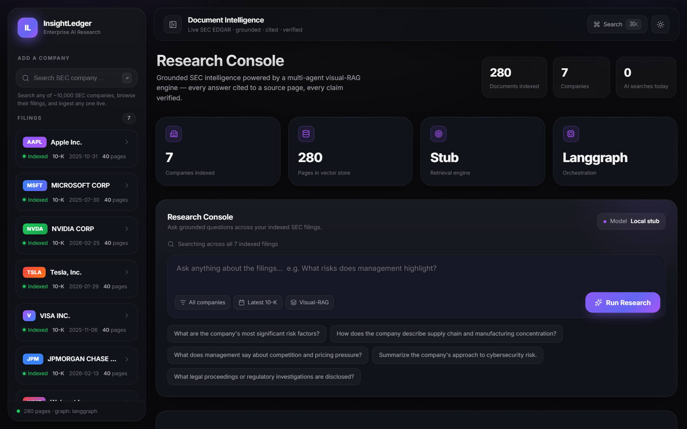
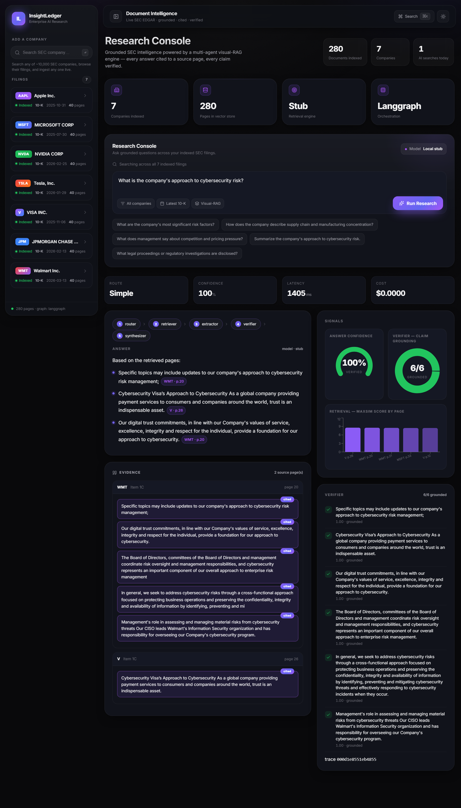
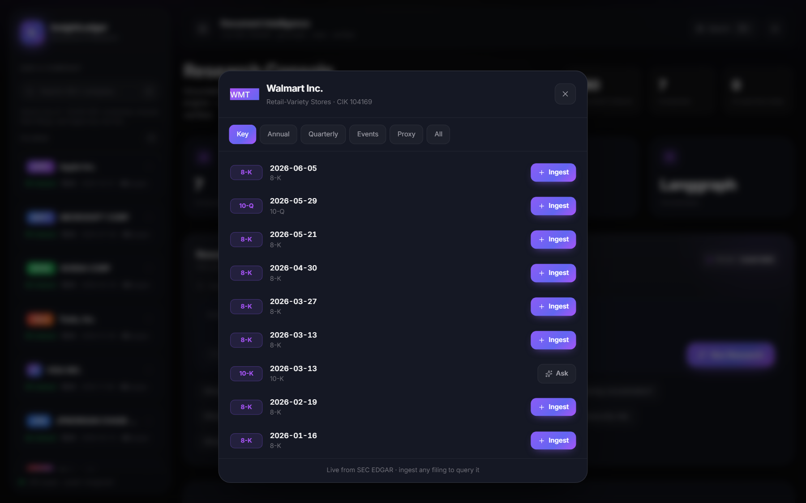
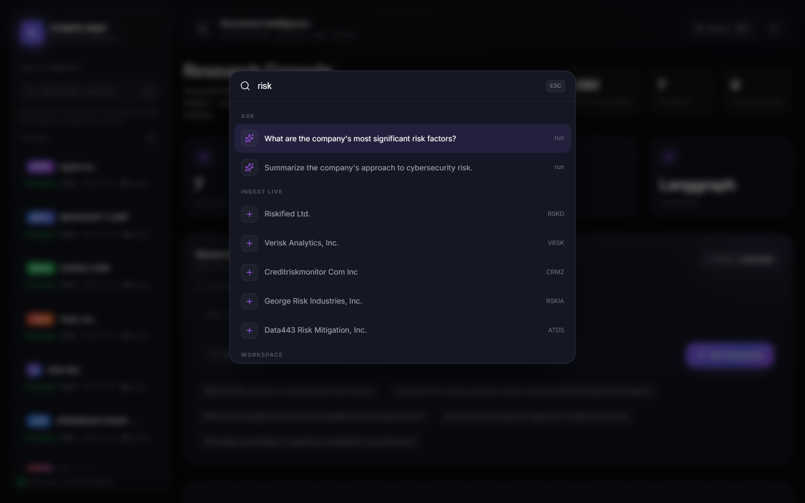

# InsightLedger

**Visual-first document intelligence — multi-agent visual-RAG over financial &
compliance filings, with region-level citations and an eval-gated pipeline.**

Most "RAG projects" chunk text → embed → cosine → stuff into an LLM. Real
financial documents lose 30–60% of their meaning that way: merged table cells
collapse, chart axes vanish, stamps and signatures disappear. InsightLedger
keeps the **rendered page** in the loop — retrieval runs over page *images*
(ColPali/ColQwen late-interaction), a VLM reads them, a **verifier agent**
grounds every claim to a specific page region, and the whole system abstains
when the answer isn't there.

> Ask *"Which segment drove ACME's operating margin improvement and by how much
> did it grow?"* — the answer lives in a chart + a footnoted table, and you get
> it back with the exact regions highlighted.

```
router ─▶ retriever ─▶ extractor ─▶ verifier ─┐(low confidence)
   ▲                                            │  widen k, retry
   └──────────────── retriever ◀────────────────┘
                                                └▶ synthesizer ─▶ grounded answer
```

## Screenshots

_Premium React dashboard, running fully local (no API key) over live SEC filings._

**Research console** — live company corpus, KPIs, and the query console


**Grounded answer** — inline citations, highlighted evidence regions, confidence gauge, verifier donut, and retrieval chart


**Company browser** — search any of ~10k EDGAR companies and ingest any filing live


**⌘K command palette** — jump to a filing, ask, or ingest a company


---

## Why it's not an API wrapper

| Production concern | How InsightLedger addresses it |
|---|---|
| **Retrieval quality** | Visual late-interaction (MaxSim) over page images, not lossy text |
| **Multi-agent orchestration** | LangGraph graph with a real **verify → re-retrieve** cycle |
| **Hallucination control** | Region-grounded citations + verifier + **abstention** on unanswerable Qs |
| **LLM evaluation** | Golden set + Ragas-style metrics (recall, faithfulness, citation IoU) |
| **LLMOps** | Per-request span traces, cost accounting, **eval-gated CI** |
| **Cost/latency** | Difficulty router sends lookups to a cheap model, reasoning to a strong one |
| **Scalability** | Qdrant native multi-vector store; stateless API; pluggable backends |

## Results (reproducible: `make compare`)

Measured on a 16-item golden set (lookups, cross-page/chart reasoning, and
adversarial *unanswerable* questions) — full numbers in [docs/METRICS.md](docs/METRICS.md):

| Metric | naive text-RAG | InsightLedger | Δ |
|---|---|---|---|
| Retrieval recall@k | 0.938 | **1.000** | +0.062 |
| Faithfulness (grounded) | 0.000 | **1.000** | +1.000 |
| Answer accuracy | 0.812 | **1.000** | +0.188 |
| Citation region IoU | 0.000 | **1.000** | +1.000 |
| Hallucination rate | 0.188 | **0.000** | −0.188 |

_(Reported on the deterministic stub backends so anyone can reproduce them.
The same harness measures the ColQwen + Claude + Qdrant stack once installed.)_

---

## Runs anywhere, scales to production

The entire system runs **with no GPU, no API keys, no external services** via
deterministic *stub* backends, and transparently upgrades to real backends when
their deps + credentials are present. Backend selection is `auto` by default:

### Fully local, no API (default)

Out of the box the app runs **100% on-machine — no API, no key, no external
call**: a deterministic stub for retrieval + generation. Everything (search,
live EDGAR ingest, the agent graph, citations, eval) works offline. For real
*local* ML with no API, set `IL_EMBEDDER=hf` (a small HF encoder, e.g.
all-MiniLM, gives true semantic retrieval in-process) and/or `IL_LLM=hf` (a local
instruct model). Those need enough RAM + **virtual-memory/pagefile** and disk for
the weights; if a model can't load, the app falls back to the stub automatically.

| Concern | Stub (default, zero-dep) | Real backend (feature-flagged) |
|---|---|---|
| Page embeddings | hashed multi-vector + MaxSim | **MiniLM/BGE** (`hf`, local) or **ColQwen2** (visual) |
| Vector store | in-process numpy MaxSim (persisted) | **Qdrant** multi-vector (MAX_SIM) |
| LLM / VLM | grounded deterministic heuristics | **HuggingFace** local model (no key) or **Claude** |
| Graph | LangGraph if installed, else linear | **LangGraph** cycle |
| Ingestion | synthetic SEC-style corpus | **SEC EDGAR** live filings |

```bash
insightledger backends   # -> {"embedder":"stub","vector_store":"memory","llm":"stub","graph":"langgraph"}
```

### LLM ladder — free & keyless by default

The LLM (claim extraction, verification, answer synthesis, and eval
**QA-generation**) follows a ladder, auto-selected so a fresh clone just runs:

| Tier | `IL_LLM` | Needs | Key? | For |
|---|---|---|---|---|
| **HF Inference** (recommended live) | `hf-api` | free `HF_TOKEN` | **free token, no GPU** | **live / deployed apps** |
| **Claude** | `claude` | `ANTHROPIC_API_KEY` | yes (paid) | best quality |
| **HuggingFace local** | `hf` | `torch`+`transformers` + compute | no key | offline, self-hosted GPU |
| **Stub** (fallback) | `stub` | nothing | no | instant, deterministic demo |

`IL_LLM=auto` picks **HF Inference** if `HF_TOKEN` is set, else **Claude** if a key
is set, else the **local HF** model if `torch`+`transformers` are installed, else
the **stub**. Any provider init failure falls back to the stub rather than crash.

**For a live / deployed app → HF Inference (serverless).** HuggingFace hosts the
model, so your app needs **no GPU, no RAM, no disk** for weights — just a free
token. Real open models (Qwen, Llama, Mistral) do live QA + QA-generation:

```bash
# free token at https://huggingface.co/settings/tokens
export HF_TOKEN=hf_xxx
export IL_HF_API_MODEL="Qwen/Qwen2.5-7B-Instruct"   # or Llama-3.1-8B-Instruct
insightledger query "What risks does management highlight?"   # runs live on HF infra
insightledger qagen --ticker AAPL                              # live QA-generation
```

**Self-hosting the weights instead (`hf`)** runs the model in-process via
`transformers` — needs `pip install torch transformers accelerate`, ~2–8 GB disk
for weights (`IL_HF_CACHE` → a drive with space), and enough RAM (use
`*-0.5B-Instruct` on small machines). GPU auto-used if present.

**QA-generation** builds an eval golden set from *live* filings using the same
local model — no key:

```bash
insightledger qagen --ticker AAPL --per-page 1   # -> data/golden/generated_qa.jsonl
```

So a cloner never needs *your* key: free on the stub, free on a local HF model,
or their own paid key for Claude. **Never commit an API key** — `.env` is
gitignored; `.env.example` is the template.

## Quickstart

```bash
pip install -r requirements.txt          # core deps only (~fast)
export PYTHONPATH=src                     # or: pip install -e .
export IL_EDGAR_USER_AGENT="Your Name you@example.com"   # SEC fair-access policy

make serve                                # web UI + API at http://localhost:8000
                                          #   ↳ ingests AAPL, MSFT, NVDA 10-Ks LIVE on first boot
make eval                                 # eval harness + CI gate (labelled fixture, offline)
make compare                              # text-RAG baseline vs InsightLedger
```

The app runs on **live SEC EDGAR filings — no mock data**. First boot ingests
the seed tickers (`IL_SEED_TICKERS`, default `AAPL,MSFT,NVDA`); add more from the
UI sidebar or `POST /ingest {ticker}`. Modern 10-Ks are inline-XBRL, so ingestion
parses with BeautifulSoup/lxml, strips the XBRL header, and splits the prose into
canonical **Item** sections (Business, Risk Factors, MD&A, …).

> The eval harness uses a small labelled synthetic corpus as a **test fixture**
> (it needs ground-truth page/region answers) in an isolated index — it is never
> served by the app.

Ask a question from the CLI:

```bash
python -m insightledger.cli query \
  "Which segment drove ACME's operating margin improvement and by how much did it grow?"
```

```
ANSWER:
Based on the retrieved pages:
- Operating margin was 18.4% in fiscal 2024 ... an improvement of 3.3 percentage points. [ACME-10K-2024 p.3]
- The Cloud Robotics segment drove the improvement, with revenue growing 42% year over year ... [ACME-10K-2024 p.3]

CITATIONS:
  - ACME-10K-2024 p.3 bbox={'x0': 0.06, 'y0': 0.34, 'x1': 0.94, 'y1': 0.65}
difficulty=complex confidence=1.00 model=stub retries=0 cost=$0.000000 latency=... trace=...
```

## Web UI (React dashboard)

`make serve` → open <http://localhost:8000>. A premium **React + Recharts +
framer-motion** dashboard (Vite build, Inter + Lucide, served by FastAPI):

- a **⌘K command palette** — jump to a filing, run a query, ingest a company, or
  toggle theme;
- a **company browser** over the full EDGAR list (~10k companies) — search any
  company, view its **entire filing history** (10-K / 10-Q / 8-K / 20-F / proxy),
  and ingest any specific filing live;
- a hero with **animated counters**, an **AI status bar**, and stat cards with
  **sparklines**;
- per-answer **visualizations**: a confidence gauge, a verifier grounding donut,
  and a retrieval MaxSim bar chart;
- the animated **agent pipeline**, the answer with inline citation chips, the
  **cited page regions highlighted** with their filing section, the verifier's
  per-claim verdicts, and a "how it works" methodology panel;
- layered glass surfaces, gradient-mesh lighting, light/dark themes, and
  reduced-motion support; abstained questions show *"no fabricated answer."*

The built assets are committed, so **the UI runs with just Python**. To develop
the frontend:

```bash
cd frontend
npm install
npm run dev        # hot-reload on :5173, proxies the API to :8000
npm run build      # rebuilds into src/insightledger/api/static/
```

## Go live (real backends)

```bash
pip install -e ".[vision,llm,qdrant]"     # ColQwen + Claude + Qdrant
export ANTHROPIC_API_KEY=sk-...            # -> llm=claude (Opus/Haiku routing)
export IL_EDGAR_USER_AGENT="Your Name you@example.com"
python scripts/ingest_live.py AAPL MSFT --form 10-K   # real SEC filings
docker compose up --build                  # app + Qdrant
```

## API

| Route | Purpose |
|---|---|
| `GET /` | premium dashboard web UI |
| `POST /query` | `{question, top_k?, doc_ids?}` → grounded `Answer` |
| `POST /ingest` | `{ticker, form?, accession?}` → index the latest (or a specific) EDGAR filing |
| `GET /tickers?q=` | search the full EDGAR company list (~10k companies) |
| `GET /company?ticker=` | company profile + full filing history (browse any filing) |
| `GET /documents` · `/documents/{id}` | corpus + page/region/section detail |
| `GET /trace/{trace_id}` | per-request agent span trace |
| `GET /health` · `POST /eval` | backends/index size · run the gate |

## Layout

```
src/insightledger/
  config.py              backend selection (auto → real|stub)
  schemas.py             pydantic contracts (BBox, Region, Claim, Answer, Eval*)
  ingestion/             EDGAR client, layout regions, synthetic corpus
  retrieval/             ColQwen|stub embedder, Qdrant|memory store, indexer
  llm/                   Claude|stub provider (difficulty routing, VLM read, verify)
  agents/                LangGraph orchestrator (router→retrieve→extract→verify⟲→synth)
  eval/                  golden set, metrics, harness + CI gate, text-RAG baseline
  observability/         span tracing + token-cost accounting
  api/                   FastAPI service + built-in web UI
tests/                   16 tests: schemas, retrieval, agents, eval, api
docs/METRICS.md          auto-generated eval report
```

See [docs/ARCHITECTURE.md](docs/ARCHITECTURE.md) for the design walk-through and
the mapping to AI-engineering job descriptions.

## Maps to AI-engineering JDs

- *"Design & evaluate RAG systems"* → visual RAG + eval harness in CI
- *"Multi-agent orchestration"* → LangGraph router/verifier graph with self-correction
- *"LLMOps / reliability"* → tracing, eval gate, cost routing, Docker
- *"Multimodal / document AI"* → retrieval + reasoning over page images, region citations
- *"Ground outputs / reduce hallucination"* → region-level citations + abstention

## Tech

Python · pydantic · LangGraph · FastAPI · numpy · ColQwen2 (ColPali) ·
Qdrant · Anthropic Claude · SEC EDGAR · pytest

## HuggingFace tasks integrated

Visual Document Retrieval · Document Question Answering · Image-Text-to-Text ·
Object Detection / Image Segmentation (layout regions) · Image Feature Extraction

## License

MIT
